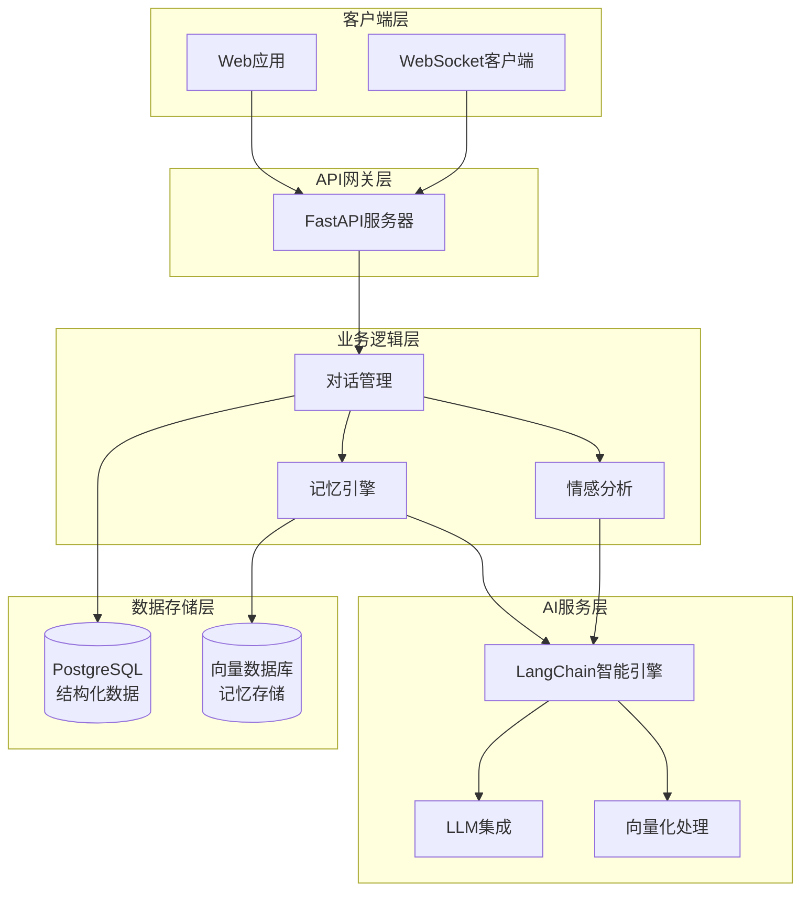

# 💖 AI GRIL FRIEND

  

## 🌟 功能特色

### 🧠 核心智能功能
- **情景记忆**：利用LangChain的记忆模块，记住你们的对话历史、重要日期和个人偏好
- **情感状态**：AI能够识别并记住你的情绪状态，调整回应方式
- **TTL记忆管理**：自动清理过期/不重要的记忆，保持记忆库相关性

## 快速开始

### clone
~~~bash
git clone https://github.com/07XYGIN/AI-GRIL-FRIEND.git
~~~

### 前端

~~~bash
cd GrilAi

# 安装依赖
pnpm install  # 或 npm install / yarn install

# 开发模式运行
pnpm dev

# 构建生产版本
pnpm build
~~~

### serve
~~~bash
uv sync

# 激活虚拟环境

# Windows:
.venv\Scripts\activate

# 启动服务

uvicorn main:app --reload --host 0.0.0.0 --port 8000
~~~

## 🏗️ 技术架构

## 里程碑

当前已完成:
- sse
- 长期记忆
- 聊天记录

正在开发:

- 文件上传
- 语音聊天
- i18n 中文 / 日语
- 渲染markdown