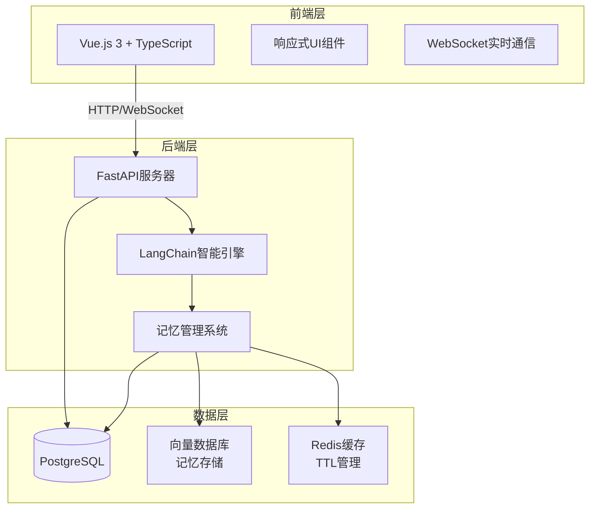

# 💖 AI GRIL FRIEND

  

一个具备**长期记忆**和**情感认知**的智能虚拟伴侣，使用现代AI技术栈构建。

## 🌟 功能特色

### 🧠 核心智能功能
- **情景记忆**：利用LangChain的记忆模块，记住你们的对话历史、重要日期和个人偏好
- **情感状态**：AI能够识别并记住你的情绪状态，调整回应方式
- **TTL记忆管理**：自动清理过期/不重要的记忆，保持记忆库相关性

## 🏗️ 技术架构

